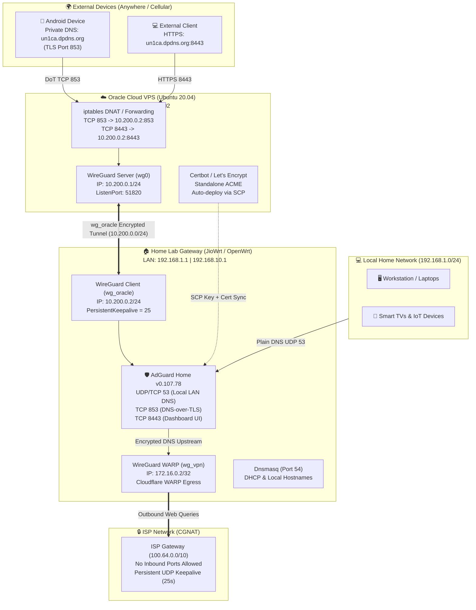

# UN1CA JioWrt Home Lab

[](https://un1ca-jiowrt.pages.dev)
[](https://un1ca.qzz.io)
[](https://un1ca.dpdns.org)
[](LICENSE)
[](https://github.com/Un1ca-dev)

> Complete real-world technical documentation of transforming a locked ISP Jio router into an enterprise-grade OpenWrt gateway with AdGuard Home, DNS-over-TLS (DoT), dual WireGuard tunnels, Oracle Cloud VPS CGNAT traversal, Cloudflare WARP egress, and Android Private DNS.

---

## 👨‍💻 Project Maintainer

- **Creator & Maintainer**: **Suman Sheikh** ([@Un1ca-dev](https://github.com/Un1ca-dev))
- **Role**: Home Lab Builder / Linux & Networking Enthusiast
- **Project**: UN1CA JioWrt Home Lab
- **Live Website**: [https://un1ca-jiowrt.pages.dev](https://un1ca-jiowrt.pages.dev) / [https://un1ca.qzz.io](https://un1ca.qzz.io)

> *"I’m Suman Sheikh, the creator of UN1CA JioWrt Home Lab. This project documents my journey of building, configuring and experimenting with OpenWrt, AdGuard Home, WireGuard, VPS, DNS, Cloudflare and self-hosted infrastructure."*

---

## 📑 Table of Contents

- [Project Overview](#-project-overview)
- [System Architecture](#-system-architecture)
- [Key Specifications & Endpoints](#-key-specifications--endpoints)
- [Dual WireGuard Tunnel Design](#-dual-wireguard-tunnel-design)
- [CGNAT Traversal & Android Private DNS (DoT)](#-cgnat-traversal--android-private-dns-dot)
- [TLS & Let's Encrypt Automation](#-tls--lets-encrypt-automation)
- [Split-Horizon DNS](#-split-horizon-dns)
- [Essential Commands Reference](#-essential-commands-reference)
- [Troubleshooting Playbook](#-troubleshooting-playbook)
- [Home Lab Website (Vite + React)](#-home-lab-website-vite--react)
- [Project Dedication & Engineering Ethos](#-project-dedication--engineering-ethos)
- [License & Credits](#-license--credits)

---

## 🌐 Project Overview

Residential ISP connections frequently restrict users through Carrier-Grade NAT (CGNAT), dynamic IPv4 allocations, locked vendor firmwares, and ISP-enforced DNS redirection. The **UN1CA JioWrt Home Lab** breaks through these barriers by:

1. **Flashing OpenWrt (JioWrt)** on router hardware to unlock Linux root control, iptables, and WireGuard.
2. **Deploying AdGuard Home (v0.107.78)** locally on the router for network-wide ad blocking, DNS caching, and encrypted DNS protocols.
3. **Overcoming CGNAT** via an encrypted WireGuard tunnel (`wg_oracle`) linking the router to a public Oracle Cloud VPS (`140.238.244.202`).
4. **Exposing DNS-over-TLS (DoT port 853)** via Oracle VPS DNAT iptables forwarding so any Android smartphone anywhere in the world can set `un1ca.dpdns.org` as its native **Private DNS Provider**.
5. **Routing Outbound Traffic through Cloudflare WARP** (`wg_vpn`) for ISP privacy and censorship circumvention.
6. **Deploying Automated TLS Deployment**: Issuing valid Let's Encrypt certificates using Certbot on the VPS and auto-deploying to AdGuard Home.

---

## 🏛 System Architecture



---

## 📊 Key Specifications & Endpoints

| Component | Identifier / IP | Port / Protocol | Function |
| :--- | :--- | :--- | :--- |
| **Router Hostname / DDNS** | `un1ca.dpdns.org` | Dynamic DNS | Public Identity for DoT and Web UI |
| **Router Primary LAN** | `192.168.1.1` | CIDR `/24` | Local Management & Gateway |
| **Router Secondary LAN** | `192.168.10.1` | CIDR `/24` | Isolated Lab Subnet |
| **Oracle Cloud VPS** | `140.238.244.202` | Ubuntu 20.04 | CGNAT Relay & Public Ingress |
| **WireGuard Ingress (`wg_oracle`)** | `10.200.0.1` $\leftrightarrow$ `10.200.0.2` | UDP 51820 (MTU 1420) | Encrypted CGNAT Bypass Tunnel |
| **WireGuard Egress (`wg_vpn`)** | `172.16.0.2` | Endpoint `162.159.193.10:2408` | Cloudflare WARP Outbound Gateway |
| **AdGuard Home Core** | v0.107.78 | UDP/TCP 53, TCP 853, TCP 8443 | Ad Blocking, DoT Server, Management |
| **Let's Encrypt Certificate** | `fullchain.pem` / `privkey.pem` | RSA 2048 / ECDSA | Valid TLS for Android Private DNS |
| **Documentation Portal** | `https://un1ca-jiowrt.pages.dev` | Cloudflare Pages | Production Web UI & Lab Guide |

---

## ⚡ Dual WireGuard Tunnel Design

The lab isolates incoming ingress traffic from outgoing privacy egress by running two independent WireGuard interfaces on JioWrt:

### 1. Ingress: `wg_oracle` (JioWrt $\leftrightarrow$ Oracle Cloud VPS)
- **Purpose**: Establishes a reverse tunnel from behind CGNAT to Oracle Cloud VPS.
- **PersistentKeepalive**: Set to `25` seconds so stateful NAT tables in the ISP router never drop UDP sessions.
- **Firewall Zone**: Assigned to `vpn_in` zone with input acceptance for port 853 and 8443.

### 2. Egress: `wg_vpn` (JioWrt $\leftrightarrow$ Cloudflare WARP)
- **Purpose**: Encrypts all outbound DNS upstream queries and designated web traffic.
- **Endpoint**: Cloudflare Edge `162.159.193.10:2408`.
- **Privacy Benefit**: Hides home IP from upstream DNS servers and prevents ISP packet inspection.

---

## 🔒 CGNAT Traversal & Android Private DNS (DoT)

Android 9+ includes native **Private DNS**, which strictly requires **DNS-over-TLS (DoT)** over standard **TCP port 853** using a trusted, unexpired CA-signed certificate matching the entered domain.

### Step-by-Step Forwarding on Oracle VPS
On the Oracle VPS (`140.238.244.202`), incoming packets destined for ports 853 and 8443 are forwarded into the WireGuard tunnel towards JioWrt (`10.200.0.2`):

```bash
# Enable IPv4 Kernel Forwarding
sysctl -w net.ipv4.ip_forward=1

# Port 853 (DNS-over-TLS) DNAT & Masquerade
iptables -t nat -A PREROUTING -p tcp --dport 853 -j DNAT --to-destination 10.200.0.2:853
iptables -t nat -A POSTROUTING -p tcp -d 10.200.0.2 --dport 853 -j MASQUERADE
iptables -A FORWARD -p tcp -d 10.200.0.2 --dport 853 -m state --state NEW,ESTABLISHED,RELATED -j ACCEPT

# Port 8443 (AdGuard HTTPS Dashboard) DNAT & Masquerade
iptables -t nat -A PREROUTING -p tcp --dport 8443 -j DNAT --to-destination 10.200.0.2:8443
iptables -t nat -A POSTROUTING -p tcp -d 10.200.0.2 --dport 8443 -j MASQUERADE
iptables -A FORWARD -p tcp -d 10.200.0.2 --dport 8443 -m state --state NEW,ESTABLISHED,RELATED -j ACCEPT
```

### Android Settings Configuration
1. Open Android **Settings** $\rightarrow$ **Network & internet** $\rightarrow$ **Private DNS**.
2. Select **Private DNS provider hostname**.
3. Enter: `un1ca.dpdns.org`
4. Tap **Save**. Android immediately verifies TLS on port 853 and locks in ad-free, encrypted DNS across 4G/5G/Public Wi-Fi.

---

## 🔐 TLS & Let's Encrypt Automation

Android Private DNS rejects self-signed certificates. A valid Let's Encrypt certificate is issued on the VPS and synchronized to the router:

1. **Issue Certificate on VPS**:
   ```bash
   certbot certonly --standalone -d un1ca.dpdns.org --preferred-challenges http
   ```
2. **Deploy to JioWrt**:
   ```bash
   scp /etc/letsencrypt/live/un1ca.dpdns.org/fullchain.pem root@10.200.0.2:/etc/adguard/fullchain.pem
   scp /etc/letsencrypt/live/un1ca.dpdns.org/privkey.pem root@10.200.0.2:/etc/adguard/privkey.pem
   ```
3. **Set Security Permissions on JioWrt**:
   ```bash
   chmod 600 /etc/adguard/privkey.pem
   chmod 644 /etc/adguard/fullchain.pem
   /etc/init.d/adguardhome restart
   ```
4. **Modulus Consistency Verification**:
   ```bash
   # Both outputs must match identically:
   openssl x509 -noout -modulus -in /etc/adguard/fullchain.pem | openssl sha256
   openssl rsa -noout -modulus -in /etc/adguard/privkey.pem | openssl sha256
   ```

---

## 🌓 Split-Horizon DNS

To guarantee lowest latency when connected at home:
- **LAN Clients (Home Wi-Fi/Ethernet)**: Resolves `un1ca.dpdns.org` $\rightarrow$ `192.168.1.1` (direct local loopback, 0.4ms latency).
- **WAN / Cellular Clients (Android 5G/LTE)**: Resolves `un1ca.dpdns.org` $\rightarrow$ `140.238.244.202` (Oracle VPS proxy, 22ms latency).

---

## 💻 Essential Commands Reference

### On JioWrt (OpenWrt)
```bash
# Check WireGuard connection status & transfer
wg show wg_oracle
wg show wg_vpn

# Test AdGuard Home DoT listener
netstat -tulpn | grep -E '(853|8443|53)'

# Verify local DNS resolution
nslookup google.com 127.0.0.1
nslookup un1ca.dpdns.org 192.168.1.1

# Monitor AdGuard logs in real time
logread -f -e AdGuardHome
```

### On Oracle Cloud VPS (Ubuntu 20.04)
```bash
# Check WireGuard peers
sudo wg show

# Verify iptables NAT forwarding rules
sudo iptables -t nat -L PREROUTING -v -n --line-numbers
sudo iptables -t nat -L POSTROUTING -v -n --line-numbers

# Test TCP port 853 reachability
openssl s_client -connect 127.0.0.1:853 -servername un1ca.dpdns.org -brief
```

---

## 🛠 Troubleshooting Playbook

| Issue | Root Cause | Solution |
| :--- | :--- | :--- |
| **Android Private DNS shows "Couldn't connect"** | Port 853 blocked by cloud firewall or TLS modulus mismatch | Open Oracle Cloud Security List ingress TCP 853; verify cert hash with `openssl sha256`. |
| **WireGuard handshake stops after few minutes** | NAT mapping expired in ISP CGNAT gateway | Add `PersistentKeepalive = 25` to JioWrt `[Peer]` configuration. |
| **AdGuard Web UI unreachable on 8443** | JioWrt firewall drop rule on `vpn_in` zone | Allow port 8443 in `/etc/config/firewall` for zone `vpn_in`. |
| **Certificate renew fails on VPS** | Web server running on port 80 during Certbot renewal | Temporarily stop HTTP service or use DNS-01 challenge mode. |

---

## 🚀 Home Lab Website (Vite + React)

This repository also hosts the modern, dark-first documentation website for the UN1CA JioWrt project.

### Tech Stack
- **Framework**: React 18 with TypeScript
- **Bundler**: Vite
- **Styling**: Tailwind CSS (cyber/terminal aesthetic)
- **Icons**: Lucide React
- **Deployment**: Cloudflare Pages (`wrangler`)

### Local Setup & Development

```bash
# 1. Clone the repository
git clone https://github.com/Un1ca-dev/UN1CA-JioWrt-HomeLab.git
cd UN1CA-JioWrt-HomeLab

# 2. Install dependencies
npm install

# 3. Start local development server
npm run dev

# 4. Build production bundle
npm run build

# 5. Preview production build locally
npm run preview
```

### Deployment to Cloudflare Pages

```bash
npm run deploy
```

---

## 💡 Project Dedication & Engineering Ethos

> **The UN1CA Engineering Cycle:**
>
> $$\textbf{Learn} \longrightarrow \textbf{Build} \longrightarrow \textbf{Break} \longrightarrow \textbf{Debug} \longrightarrow \textbf{Understand} \longrightarrow \textbf{Improve}$$

This documentation is dedicated to curious self-hosters and network engineers who refuse to accept restricted ISP routers and locked-down gateways.

---

## 📜 License & Credits

- **Author**: **Suman Sheikh** ([Un1ca-dev](https://github.com/Un1ca-dev))
- **License**: Released under the [MIT License](LICENSE).
- **Attribution**:
  - OpenWrt Project & OpenWrt Community
  - AdGuard Home Team
  - WireGuard by Jason A. Donenfeld
  - Cloudflare & Oracle Cloud Infrastructure
